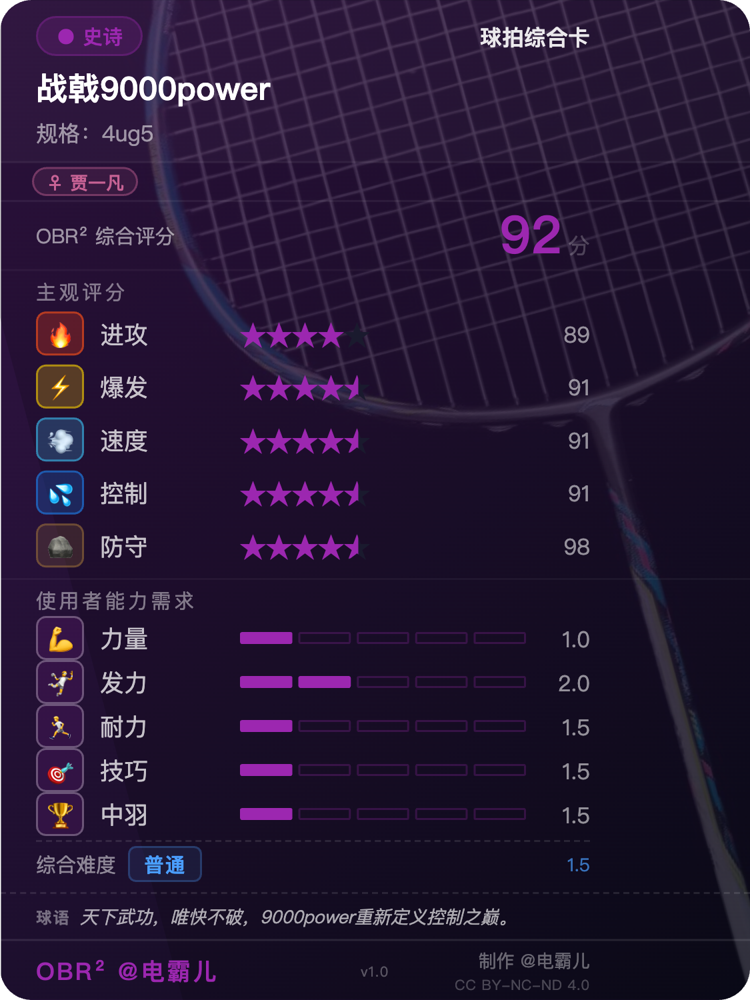
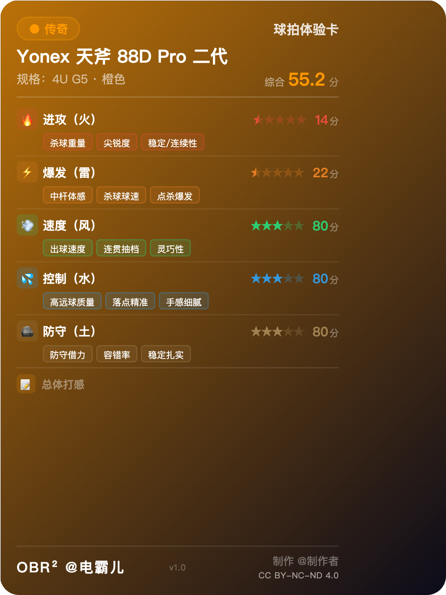
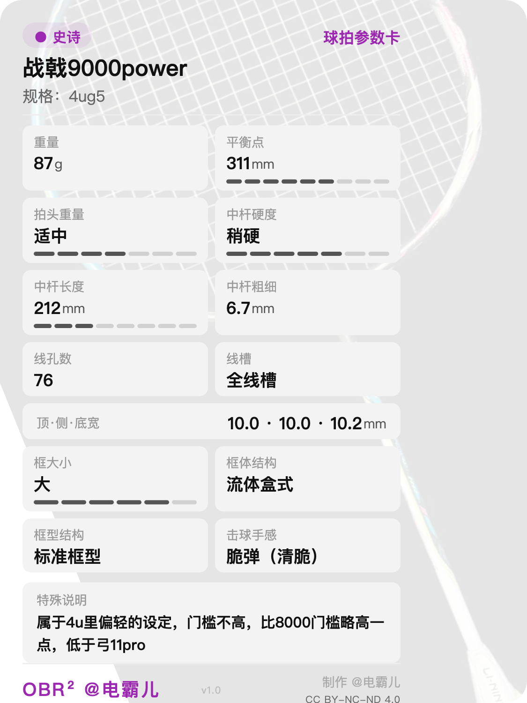
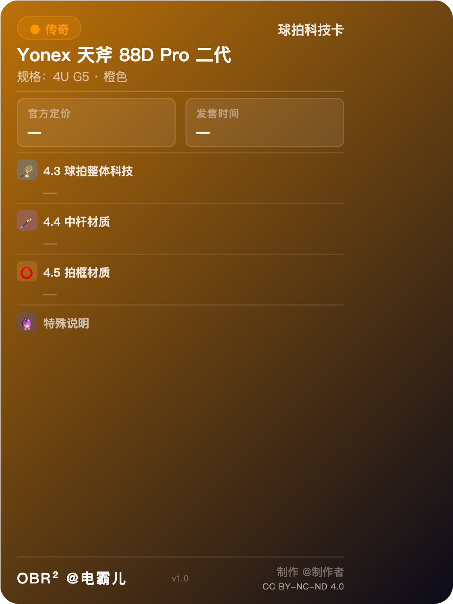

# OBR²

**Open Badminton Racket Rating · 开放羽毛球拍评测标准**

**Language / 语言：** [🇨🇳 中文](./README.md) | 🇺🇸 English

**Original Author:** @电霸儿 (Bilibili · Douyin · Xiaohongshu · YouTube · Zhihu)  
**Companion Tool:** OBR² Open Rating Tool

---

## Table of Contents

- [Background](#background)
- [Card Type Preview](#card-type-preview)
- [References & Inspirations](#references--inspirations)
- [OBR² Rating Standard](#obr-rating-standard)
  - [I. Racket Subjective Score](#i-racket-subjective-score)
  - [II. Player Ability Requirements](#ii-player-ability-requirements)
  - [III. Objective Racket Parameters](#iii-objective-racket-parameters)
  - [IV. Technology Parameters](#iv-technology-parameters)

---

## Background

Badminton racket reviews on the market are inconsistent and lack a unified standard. OBR² was created to solve the following problems:

1. Provide a unified evaluation standard to resolve the inconsistency in reviews.
2. Based on a shared standard, aggregate subjective feedback from all reviewers to derive an average score, offering reliable reference for racket buyers.
3. The standard is simple and easy to understand — a single OBR² rating card lets anyone instantly see whether a racket fits their needs.

---

## Card Type Preview

<table>
<tr>
<td align="center" width="50%">

 <b>① Overall Card</b> 5-Element Scores · Ability Requirements · Difficulty
</td>
<td align="center" width="50%">

 <b>② Feel Card</b> Five-Element Feel Details · Overall Impression
</td>
</tr>
<tr>
<td align="center" width="50%">

 <b>③ Spec Card</b> Objective Parameters · Visual Progress Bars
</td>
<td align="center" width="50%">

 <b>④ Tech Card</b> Technology & Material Tags · Special Notes
</td>
</tr>
</table>

---

## References & Inspirations

1. Chinese Five Elements (Metal · Wood · Water · Fire · Earth)
2. Japanese anime settings — Naruto, Demon Slayer (Fire · Thunder · Wind · Water · Earth)
3. World of Warcraft — Equipment quality tiers (White · Green · Blue · Purple · Gold). Gold tier requires significant historical status or a performance that stands unmatched in its era.
4. The Five Tiger Generals of the Three Kingdoms (Guan Yu · Zhang Fei · Zhao Yun · Huang Zhong · Ma Chao) — each representing a distinct playstyle archetype.
5. Diablo — Difficulty design (Normal · Nightmare · Hell), referenced for the Overall Difficulty tier system.

---

## OBR² Rating Standard

The standard is primarily subjective, supplemented by objective data — because objective specs can be measured by instruments and thus vary little between reviewers. Subjective experience, however, differs based on the player's skill and physical condition. The standard therefore covers three areas:

1. Player's personal ability (it is recommended to rate when in peak physical condition)
2. Objective racket parameters (specs & technology)
3. Racket subjective score (the core)

---

## I. Racket Subjective Score

### Scoring System

| Score | Fail | 60 | 65 | 70 | 75 | 80 | 85 | 90 | 95 | 100 |
|:-----:|:----:|:--:|:--:|:--:|:--:|:--:|:--:|:--:|:--:|:---:|
| Stars | 0.5★ | 1★ | 1.5★ | 2★ | 2.5★ | 3★ | 3.5★ | 4★ | 4.5★ | 5★ |

---

### 1.1 Attack (Fire) — Guan Yu

Key evaluation indicators:

1. Smash heaviness
2. Smash sharpness
3. Smash stability

### 1.2 Power (Thunder) — Zhang Fei

Key evaluation indicators:

1. Shaft explosive power
2. Smash explosive power
3. Smash consistency

### 1.3 Speed (Wind) — Zhao Yun

Key evaluation indicators:

1. Swing speed
2. Shot release speed
3. Rally fluency & stability

### 1.4 Control (Water) — Huang Zhong

Key evaluation indicators:

1. Landing accuracy
2. Solid & stable contact
3. Comfortable touch

### 1.5 Defense (Earth) — Ma Chao

Key evaluation indicators:

1. Defensive capability
2. Fault tolerance
3. Passive/reactive situations

---

### Examples

The following examples feature rackets from Yonex, Victor, Gosen, and Li-Ning:

| Racket | Spec | Attack 🔥 | Power ⚡ | Speed 🌬️ | Control 💧 | Defense 🌍 | Avg |
|--------|:----:|:---------:|:-------:|:--------:|:---------:|:----------:|:---:|
| Yonex Duora 10 LT (Purple) | 4ug5 | 4★ 90 | 4★ 90 | 4★ 90 | 5★ 100 | 4.5★ 95 | **93** |
| Yonex Astrox 100ZZ VA (Orange) | 4ug5 | 5★ 100 | 5★ 100 | 4★ 90 | 5★ 100 | 3.5★ 85 | **95** |
| Yonex Nanoflare 1000Z (Purple) | 4ug5 | 4.5★ 95 | 5★ 100 | 5★ 100 | 4★ 90 | 3.5★ 85 | **94** |
| Yonex Astrox 99 (Orange) | 4ug5 | 4.5★ 95 | 4.5★ 95 | 3.5★ 85 | 5★ 100 | 4★ 90 | **93** |
| Yonex Astrox 99 Pro 2nd Gen (Purple) | 4ug5 | 5★ 100 | 4.5★ 95 | 3★ 80 | 4★ 90 | 3.5★ 85 | **90** |
| Yonex Astrox 88D Pro 2nd Gen (Purple) | 4ug5 | 4.5★ 95 | 5★ 100 | 4.5★ 95 | 4★ 90 | 4.5★ 95 | **95** |
| Yonex Arcsaber 11 Pro (Purple) | 4ug5 | 3.5★ 85 | 4★ 90 | 4★ 90 | 4.5★ 95 | 4.5★ 95 | **91** |
| Yonex Armortec 700 (Orange) | 4ug5 | 4.5★ 95 | 4.5★ 95 | 3★ 80 | 5★ 100 | 4★ 90 | **92** |
| Victor MX80 — Original Taiwan (Purple) | 4ug5 | 4★ 90 | 4.5★ 95 | 4★ 90 | 4★ 90 | 4★ 90 | **91** |
| Victor MX80N — Nanjing Edition (Purple) | 4ug5 | 4★ 90 | 4★ 90 | 4★ 90 | 4★ 90 | 4★ 90 | **90** |
| Victor THRUSTER RYUGA METALLIC (Purple) | 4ug5 | 5★ 100 | 4★ 90 | 3★ 80 | 4★ 90 | 3.5★ 85 | **89** |
| Victor AURASPEED 90K METALLIC (Purple) | 4ug5 | 4★ 90 | 4★ 90 | 4.5★ 95 | 4★ 90 | 4.5★ 95 | **92** |
| Gosen Roots 6900SP (Purple) | 3ug5 | 3.5★ 85 | 4.5★ 95 | 3.5★ 85 | 4.5★ 95 | 4★ 90 | **90** |
| Gosen Ryoga Shiden (Orange) | 3ug5 | 4★ 90 | 5★ 100 | 4★ 90 | 3.5★ 85 | 3.5★ 85 | **90** |
| Gosen Ryoga Ougi (Orange) | 3ug5 | 3.5★ 85 | 4.5★ 95 | 4.5★ 95 | 4★ 90 | 3.5★ 85 | **90** |
| Gosen Ryoga Tenbu (Orange) | 3ug5 | 3.5★ 85 | 4★ 90 | 4★ 90 | 4.5★ 95 | 4.5★ 95 | **91** |
| Gosen Ryoga Issen (Orange) | 3ug5 | 4.5★ 95 | 4★ 90 | 3.5★ 85 | 4.5★ 95 | 4★ 90 | **91** |
| Li-Ning AXFORCE90NEW (Purple) | 5ug5 | 4★ 90 | 4.5★ 95 | 4.5★ 95 | 3.5★ 85 | 4★ 90 | **91** |
| Li-Ning AXFORCE80 (Purple) | 4ug5 | 4★ 90 | 4★ 90 | 3.5★ 85 | 4★ 90 | 4★ 90 | **89** |
| Li-Ning HALBERTEC8000 (Purple) | 4ug5 | 4★ 90 | 4★ 90 | 4★ 90 | 4★ 90 | 5★ 100 | **92** |

---

## II. Player Ability Requirements

Rated on 5 levels (1–5). The higher the level, the greater the physical demands placed on the player.

### 2.1 Strength

Key evaluation indicator:

The actual mass the player can generate at the shuttle head during a stroke — the sum of full-body muscle force output.

### 2.2 Power Generation

Key evaluation indicator:

The explosive force delivered to the shuttle head during a stroke; how fast the racket can accelerate to shuttle-contact speed.

### 2.3 Endurance

Key evaluation indicator:

Full-body endurance; insufficient endurance leads to diminished power output in the latter half of a match.

### 2.4 Skill

Key evaluation indicator:

Technical proficiency and badminton IQ.

### 2.5 Zhongyu Level

Key evaluation indicator:

Player level as defined by the Chinese Badminton Forum (Zhongyuqiumi.com). Use the official 1–5 scale from the forum.

### 2.6 Overall Difficulty

The average of scores from 2.1–2.5, mapped to six difficulty tiers (0–5). The higher the tier, the greater the overall physical and technical demands on the player.

| Tier | Label | Target Players |
|:----:|:-----:|---------------|
| 0 | Beginner | Virtually no barrier — anyone can handle it |
| 1 | Casual | Entry-level recreational players |
| 2 | Standard | Amateur players with a solid foundation |
| 3 | Hard | Requires strong physical conditioning and technical skill |
| 4 | Nightmare | Very high demands across all player attributes |
| 5 | Inferno | Elite athlete level — extremely difficult for most players |

---

### Examples

| Racket | Spec | Strength | Power Gen. | Agility | Skill | Zhongyu Lvl | Overall Difficulty |
|--------|:----:|:--------:|:----------:|:-------:|:-----:|:-----------:|:-----------------:|
| Yonex Duora 10 LT | 4ug5 | 4 | 2 | 1 | 1 | 2 | 2 Standard |
| Yonex Astrox 100ZZ VA | 4ug5 | 4 | 4 | 1 | 2 | 3 | 3 Hard |
| Yonex Astrox 100ZZ (Navy) | 4ug5 | 4 | 5 | 2 | 3 | 4 | 4 Nightmare |
| Yonex Nanoflare 700 | 4ug5 | 1 | 1 | 3 | 2 | 1 | 2 Standard |
| Yonex Astrox 99 Pro 2nd Gen | 4ug5 | 5 | 5 | 2 | 2 | 5 | 4 Nightmare |
| Victor MX80 | 4ug5 | 4 | 3 | 1 | 3 | 3 | 3 Hard |

---

## III. Objective Racket Parameters

| No. | Parameter | Description |
|:---:|-----------|-------------|
| 1 | Specification | 2ug4 2ug5 3ug4 3ug5 3ug6 4ug4 4ug5 4ug6 5ug5 5ug6 6ug5 6ug6 |
| 2 | Balance Point (numeric) | 1–7 |
| 3 | Balance Point (text) | Extra Light · Light · Slightly Light · Even · Slightly Head-Heavy · Head-Heavy · Extra Head-Heavy |
| 4 | Weight — Full setup, grip cap removed | Accurate to 0.1g, e.g. 89.1g |
| 5 | Balance Point — Full setup, grip cap removed | Accurate to 1mm, e.g. 313mm |
| 6 | Weight — Full setup, grip cap on | Same as above |
| 7 | Balance Point — Full setup, grip cap on | Same as above |
| 8 | Weight — Unstrung | Same as above |
| 9 | Balance Point — Unstrung | Same as above |
| 10 | Swing Weight | e.g. SW90 |
| 11 | Head Weight Feel (numeric, no instrument) | 1–7 |
| 12 | Head Weight Feel (text, no instrument) | Extra Light · Light · Slightly Light · Even · Slightly Heavy · Heavy · Extra Heavy |
| 13 | Racket Length | 665 / 670 / 675 / 680 mm |
| 14 | Handle Length | From top of cone cap to grip end, e.g. 210mm |
| 15 | Shaft Length | Accurate to 1mm; from widest point of cone cap to shaft-frame junction, e.g. 220mm |
| 16 | Shaft Diameter | Accurate to 0.1mm; measured at the base of the shaft |
| 17 | Special Shaft Design | Describe any non-uniform shaft (e.g. thinner at top, thicker at bottom like Purple Thunder) |
| 18 | Shaft Stiffness (numeric) | 1–7 |
| 19 | Shaft Stiffness (text) | Extra Flexible · Flexible · Slightly Flexible · Medium · Slightly Stiff · Stiff · Extra Stiff |
| 20 | Shaft Flex Point | Upper · Middle · Lower |
| 21 | Shaft Feel Type | Monolithic · Whip |
| 22 | Grommet Holes | 68 / 70 / 72 / 76 / 78 / 80 |
| 23 | String Channel | Half-channel Upper · Half-channel · Half-channel Lower · 3/4 Channel · Full Channel · Open Top & Bottom |
| 24 | Frame Width at 12 o'clock | Accurate to 0.1mm, e.g. 10.1mm |
| 25 | Frame Width at 3 o'clock | Accurate to 0.1mm, e.g. 9.8mm |
| 26 | Frame Width near 6 o'clock | Accurate to 0.1mm, e.g. 12.4mm |
| 27 | Frame Thickness at 12 o'clock | Accurate to 0.1mm, e.g. 5.1mm |
| 28 | Frame Body Structure | Box Frame · Fluid Box · Blade Frame · Aero Frame · Hybrid Frame |
| 29 | Frame Shape | Standard · Bullet · Warhead · Small Flat Top · Slim · Thin-edge |
| 30 | Frame Size (numeric) | 1–6 |
| 31 | Frame Size (text) | Extra Small · Small · Slightly Small · Slightly Large · Large · Extra Large |
| 32 | Frame Hit Feedback | Stiff (powerful) · Crisp (sharp) · Elastic (ball-holding) |

---

## IV. Technology Parameters

### 4.1 Official Pricing
  CNY, JPY, or USD are all acceptable.
### 4.2 Release Date
  Year and month is sufficient, e.g. 2025.10
### 4.3 Overall Racket Technology
  Describe the racket's overall technologies, separated by commas.
  e.g. WES 3.0, Levitation Technology, Aero-Dynamic Hexagonal Frame, Energy Shield
### 4.4 Shaft Material
  Describe the shaft material technologies, separated by commas.
  e.g. High-modulus Carbon Fiber, Alloy Carbon Fiber, PYROFIL
### 4.5 Frame Material
  Describe the frame material technologies, separated by commas.
  e.g. High-modulus Carbon Fiber, 46T PYROFIL, Alloy Carbon Fiber, Nano Aerogel, Core-Force Fill Technology, TR Nano-Carbon Tube

---

## License

Copyright © 2024 @电霸儿. All Rights Reserved.

This work is licensed under the [Creative Commons Attribution-NonCommercial-NoDerivatives 4.0 International License (CC BY-NC-ND 4.0)](https://creativecommons.org/licenses/by-nc-nd/4.0/).

**You are free to:**
- Share — copy and redistribute the material in any medium or format.

**Under the following terms:**
- **Attribution** — You must credit the original author @电霸儿 and include a link to this project.
- **NonCommercial** — You may not use the material for commercial purposes or monetization.
- **NoDerivatives** — You may not remix, transform, or build upon the material and redistribute your result.

**Card Generator Usage Rules:**
- Anyone may use the card generator tools provided in this project to create their own review cards.
- **You must NOT use `@电霸儿` as the author name** in any generated content. This signature is the exclusive identifier of the original creator; impersonation constitutes infringement.
- When publishing content generated with these tools, we recommend noting "Based on the OBR² Rating Framework" with a link to this project.

> For commercial licensing (including but not limited to publishing, brand partnerships, or paid content), please contact @电霸儿 via Bilibili, Douyin, Xiaohongshu, YouTube, or Zhihu for written authorization.
